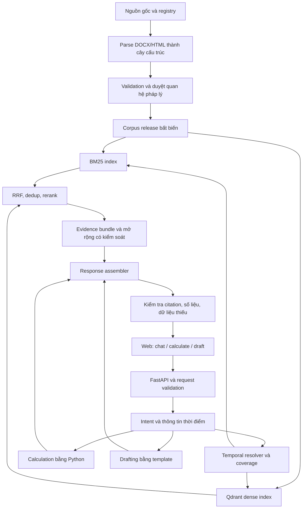

# Bản review thiết kế v1.2 — Lưu tham khảo

> **Lưu ý:** Bản tham khảo lịch sử sau review; từ yêu cầu tiếp theo, dùng technical_design.md cho tổng thể và phase1_design.md/phase2_design.md cho thực thi. Không yêu cầu xây toàn bộ cấu trúc ở đây trước baseline.
>
> **Version:** 1.2 — 2026-09-16, thiết kế điều chỉnh sau review Phase 1.
> **Trạng thái:** Đặc tả đích để triển khai; không khẳng định code/corpus hiện tại đã đáp ứng.
> **Căn cứ:** Project.md, operations_guide.md, session_state.md và [review Phase 1](review.md).
> **Ưu tiên:** Chất lượng, khả năng kiểm chứng, ngân sách API $0; không lấy 10 tuần/3 người làm giới hạn thiết kế. Giữ lịch sử quyết định trong session_state.md.

## 0. Phạm vi, giả định và thay đổi so với v1.1

Sản phẩm phục vụ NLĐ/NSDLĐ/HR: tra cứu có căn cứ, năm hàm tính toán (thôi việc, mất việc, thử việc, BHTN, phép năm) và ba mẫu soạn thảo. Web-first; không thêm native app, fine-tuning hoặc cơ sở dữ liệu graph chuyên dụng ở giai đoạn này.

Review 16/09/2026 đo được 107 DOCX đếm đệ quy, 102 Markdown, 103 cleaned JSON, 2.041 chunks, 1.969 ID duy nhất, 95 relations. Đây là số artifacts; không đồng nghĩa 107 văn bản pháp luật khác nhau. BLLĐ 2019 thiếu trong JSONL, 78,1% chunks thiếu ngày hiệu lực và tất cả thiếu URL nguồn. **Gate 1 mở lại; chỉ index release được xác minh.**

Giữ BGE-M3, Qdrant, BM25 + dense + RRF, Python deterministic và Jinja2. Các thay đổi chính:

1. Registry làm nguồn sự thật cho danh tính văn bản; tách nguồn, provision, phiên bản và chunk.
2. Parser đọc được Word numbering, phụ lục, biểu mẫu, bảng và điều khoản được trích trong văn bản sửa đổi.
3. Chỉ quan hệ được duyệt mới thay đổi hiệu lực; lọc theo khoảng thời gian ở cấp khoản/điểm khi cần.
4. Phân biệt Qdrant embedded và Qdrant server local; cùng điều kiện hợp lệ cho BM25/dense/graph.
5. Citation gắn evidence và thời điểm; từ chối hoặc yêu cầu bổ sung khi không đủ căn cứ.
6. Publish corpus và indexes theo cùng release; evaluation theo logical provision, sửa gate Precision@5.

Các con số latency, VRAM, quota và chất lượng trong v1.1 là giả định chưa đo, không phải SLA. BGE-M3 có 1.024 chiều và sequence limit 8.192 token; tokenizer budget phải được kiểm tra trước encode. Không suy rằng 4 GB VRAM luôn đủ hoặc được cắt vector còn 512 chiều mà giữ chất lượng. [Model card](https://huggingface.co/BAAI/bge-m3).

## 1. Kiến trúc tổng thể

### 1.1. Luồng dữ liệu và request



### 1.2. Nguyên tắc bất biến

- LLM trích tham số/soạn diễn đạt; phép tính và chọn rule version do Python thực hiện.
- Luật áp dụng được quyết định bằng căn cứ, thời điểm, phạm vi và chuyển tiếp; không bằng similarity hay độ mới của văn bản.
- Retrieval không được đưa dữ liệu `unknown`, chưa duyệt hoặc sai version vào evidence dùng để kết luận. Có thể hiển thị phần thiếu dưới dạng cảnh báo rõ ràng.
- Phân biệt thiếu corpus với câu hỏi ngoài phạm vi; không khẳng định “pháp luật không quy định” chỉ vì tìm không ra.
- Nguồn raw giữ nguyên; mọi transformation phải truy ngược được. Không OCR dữ liệu luật theo quyết định dự án.
- Một request dùng đúng một `release_id`. Backend stateless theo request; module interfaces là Pydantic models, không phụ thuộc frontend.

## 2. Data pipeline

### 2.1. Registry, nguồn và coverage

**Chọn:** file registry versioned (`data/registry/documents.json`, `sources.json`, `coverage.json`), validate bằng Pydantic; nạp lookup vào RAM ở quy mô hiện tại. SQLite là phương án sau nếu cần nhiều người ghi đồng thời; graph database chưa có lợi ích đủ rõ. Không dùng tên file hay LLM làm định danh chính thức.

Mỗi nguồn có `source_id`, đường dẫn tương đối nguyên gốc, SHA-256, URL nguồn, ngày thu thập, định dạng, phương thức extraction và trạng thái kiểm chứng. Hai DOCX cùng basename nhưng khác hash là hai source records riêng. `raw/word/<parent>/<file>` không được flatten mất parent. Nhiều nguồn có thể cùng một document; cần người duyệt xác định bản gốc, hợp nhất, phụ lục và phiên bản sửa đổi.

Document có `doc_id` nội bộ ổn định, `doc_number` canonical để hiển thị, alias được duyệt, tên đúng theo đầu văn bản, loại, ngày ban hành/hiệu lực và source references. Canonical ví dụ `145/2020/NĐ-CP`, giữ dấu gạch ngang trong cơ quan. Không áp dụng regex số/năm một cách tuyệt đối cho VBHN/quyết định có cấu trúc số khác; registry có validator theo loại. Không khớp identity → quarantine và ghi lý do.

Cổng Chính phủ/VBPL là nguồn đối chiếu ưu tiên; DOCX tải thủ công vẫn được dùng nếu map được tới văn bản nguồn. TVPL/LuatVietnam là nguồn bổ trợ, không mặc định bản tải là đầy đủ hay hiện hành. Khi trang thuộc tính mâu thuẫn với nội dung/điều khoản thi hành, giữ conflict và kiểm tra bản ký; không copy status của trang một cách mù quáng.

Coverage quản lý theo **chủ đề × khoảng ngày × nhóm đối tượng**. Mỗi release công bố `verified_as_of`, phạm vi đã kiểm tra và những thiếu hụt. Không dùng ngày crawl thay cho ngày “luật còn đúng đến”. Không tự thu hẹp ngày áp dụng để làm gate pass.

Backlog tối thiểu phát hiện trong review:

- Khôi phục nguồn và output của BLLĐ 2019; xác minh file đang mang tên BHXH nhưng chứa BHYT 25/2008.
- Bổ sung Luật BHXH 41/2024, có hiệu lực 01/07/2025, cùng hướng dẫn/chuyển tiếp liên quan. [Điều 140–141](https://xaydungchinhsach.chinhphu.vn/toan-van-luat-so-41-2024-qh15-bao-hiem-xa-hoi-119240723163650489.htm).
- Bổ sung Luật Việc làm 74/2025, hiệu lực 01/01/2026, và kiểm tra NĐ 374/2025 về BHTN. [Luật Việc làm](https://xaydungchinhsach.chinhphu.vn/toan-van-luat-viec-lam-119250711173403835.htm), [NĐ 374/2025](https://chinhphu.vn/?docid=216493&pageid=27160&typegroupid=4).
- Bổ sung NĐ 293/2025 thay NĐ 74/2024 từ 01/01/2026; version hóa cả danh mục địa bàn. [Điều 5 NĐ 293/2025](https://xaydungchinhsach.chinhphu.vn/nghi-dinh-so-293-2025-nd-cp-quy-dinh-muc-luong-toi-thieu-doi-voi-nguoi-lao-dong-lam-viec-theo-hop-dong-lao-dong-119251110172808433.htm).
- Tiếp tục inventory chuỗi sửa đổi BHYT, lao động nước ngoài, Công đoàn/ATVSLĐ khi các chủ đề đó nằm trong scope release. Danh sách trên chưa phải chứng nhận đầy đủ pháp luật đến tháng 9/2026.

### 2.2. Parse và chunk theo cấu trúc

**Chọn:** cây cấu trúc (document → body/annex/form → chapter/section/article/clause/point/table) và child retrieval/parent evidence. Fixed-size split thuần bị loại vì mất địa chỉ pháp lý; clause-only cho mọi trường hợp tạo quá nhiều mảnh thiếu ngữ cảnh.

DOCX extractor đọc `document.xml`, `numbering.xml`, styles, numbering overrides/restarts; xử lý paragraph và table theo thứ tự gốc, giữ header/row/column spans và ô gộp. Review đã chứng minh Luật ATVSLĐ mất `Điều %1.` trong bước conversion. Nếu format không giải được, quarantine; không đoán số Điều.

Parser phải:

- Phân biệt số Điều là string (`1`, `1a`), Khoản/Điểm và numbering trong quoted amendment.
- Reset Mục khi sang Chương và reset các cấp con khi đổi cấp cha; ghép tên chương ở dòng kế tiếp, không nhận cụm “phần vốn...” như heading.
- Đóng Điều khi sang phụ lục/biểu mẫu; giữ `content_kind` và parent document. Điều 1 trong mẫu HĐLĐ không phải Điều 1 NĐ 145.
- Tài liệu luật không có Điều → parse failure cần review; chỉ cho phép ALL với loại nguồn đã xác minh không chia Điều.
- Giữ raw text; NFC và chuẩn hóa khoảng trắng có log. Chỉ loại watermark theo mẫu nhận diện hẹp; không xóa cả dòng vì chứa “luật Việt Nam” hoặc URL.

Chunk cơ bản là một Điều; Điều dài chia theo nhóm Khoản, giữ heading và introductory scope. Mốc 2.000 ký tự chỉ là heuristic đọc hiểu, không là giới hạn encoder. Đo `token_count` bằng đúng tokenizer/revision sẽ dùng ở Phase 2. Khởi điểm thử `target_tokens=512`, `max_tokens=1024`, phải gồm prefix/context và luôn nhỏ hơn giới hạn model; đây là tham số benchmark, không chân lý pháp lý.

Khoản vượt budget: giữ nguyên full parent, tách child theo Điểm; nếu một Điểm vẫn vượt thì tách tại ranh giới câu hoặc nhóm hàng bảng, gắn `is_fragment`, offset và parent locator. Fragment không được trình bày như toàn bộ Khoản. Nếu không thể tách có nghĩa, không encode âm thầm truncate; đưa vào queue xử lý. Khi trả lời phải fetch phần mở đầu/điều kiện cần thiết; không đủ context budget thì báo thiếu căn cứ.

Bảng chia theo nhóm hàng có lặp header, ghi đơn vị và reference hàng/cột; biểu mẫu lưu nguyên artifact và các preview chunks có lineage. Câu hỏi luật mặc định ưu tiên `normative`, không cho mẫu/placeholder làm căn cứ quy phạm. Annex chứa quy phạm vẫn được retrieval nếu xác minh content kind, không loại mọi phụ lục.

### 2.3. Metadata schema v2 — contract trước embedding

Tách bốn khái niệm:

- **Source:** bytes/file/URL đã thu thập, immutable, có hash.
- **Provision:** đơn vị pháp lý ổn định (`doc_id + structural_path`), độc lập cách chunk.
- **Provision version:** nội dung/hiệu lực của provision qua thời gian, có lineage tới bản gốc và amendment events.
- **Chunk:** mảnh phục vụ search của đúng version, không phải đơn vị gán nhãn eval duy nhất.

Các records được kiểm tra chặt theo `schema_version=2`; ghi spec/migration trước khi chạy rebuild. Fields bắt buộc cho normative chunk:

```json
{
  "schema_version": 2,
  "release_id": "<corpus release>",
  "chunk_id": "<deterministic UUID>",
  "provision_id": "<stable logical locator>",
  "provision_version_id": "<locator + version identity>",
  "doc_id": "<registry id>",
  "doc_number": "<verified canonical display number>",
  "doc_title": "<verified title>",
  "doc_type": "nghi_dinh",
  "content_kind": "normative",
  "structural_path": ["body", "article:4", "clause:2"],
  "article_number": "4",
  "clause_numbers": ["2"],
  "point_letters": [],
  "parent_id": "<parent provision version>",
  "hierarchy_path": "<display path>",
  "issued_date": "<ISO date>",
  "valid_from": "<ISO date>",
  "valid_to": null,
  "verification_status": "verified",
  "content": "<source-grounded text>",
  "content_hash": "<SHA-256>",
  "content_length": 0,
  "token_count": 0,
  "is_fragment": false,
  "topic_tags": ["<controlled vocabulary>"],
  "source_refs": [{"source_id": "<id>", "source_url": "<verified URL>", "locator": "<paragraph/table/span>"}],
  "applied_relation_ids": []
}
```

Đây là minh họa field names, không phải fixture hợp lệ: thay placeholders và lengths thật trước validation. `valid_to=null` chỉ nghĩa chưa có kết thúc được xác nhận **trong coverage đã kiểm tra**, không chứng minh hiệu lực vô hạn. Candidate có thể thiếu dates/URL nhưng không được `verified` hay published as normative. Ngày lưu `YYYY-MM-DD`, kiểm tra calendar và `valid_to > valid_from`; thiếu dùng null thay vì chuỗi rỗng.

UUID xác định từ namespace dự án + provision/version + chunk part + content hash; phát hiện collision trước upsert. Không tạo UUID từ ID legacy đang trùng. Lưu `source_span`, thu thập (`collected_at`) và transformation/tool versions ở source/manifest, không gắn `embedding:null` vào source-of-truth JSONL. Cache embeddings riêng theo model revision + encoding config + text hash.

`topic_tags` dùng vocabulary ổn định như `tro_cap_thoi_viec`, `bao_hiem_y_te`; tiêu đề đầy đủ là `title`, không thay thế taxonomy. Cross-reference records phân biệt cùng văn bản và khác văn bản, có resolved target hoặc trạng thái unresolved; bỏ self-reference sinh ra chỉ do heading.

Migration v1 → v2:

1. `issue_date → issued_date`, `chunk_length → content_length`; `url → source_refs` chỉ sau xác minh URL.
2. Không lấy `clause_range` duy nhất từ suffix ID vì ID hiện trùng; reparse để có arrays Khoản/Điểm và structural path.
3. Không map mọi `con_hieu_luc` cũ thành verified; temporal validity được rebuild từ registry và events đã duyệt.
4. Kết quả migration phải kiểm tra identity/coverage/dedup và sampling nguồn; giữ release cũ để đối chiếu.

### 2.4. Quan hệ pháp lý, versioning và chuyển tiếp

**Chọn:** verified event records trong JSON + temporal resolver Python. Regex chỉ tạo proposals. Neo4j/LLM auto-repeal bị loại vì tăng độ phức tạp mà không giải quyết tính đúng pháp lý; hợp nhất thủ công toàn corpus ngay lập tức quá nặng. Bản hợp nhất chính thức là nguồn bổ trợ có lineage, không tự coi ngày hợp nhất là ngày luật có hiệu lực.

Event fields: `relation_id`, `relation_type`, `source_doc_id`, `source_provision_id`, `target_doc_id`, `target_locators[]`, `scope`, `operation`, `effective_from`, `effective_to`, `evidence_source_id`, `evidence_locator`, `review_status`, `reviewed_by`, `reviewed_at`, `notes`.

- `relation_type`: references/guides/amends/supplements/replaces/repeals; `scope`: document/provision/fragment/unknown.
- Duyệt mọi thay đổi có thể ảnh hưởng nghĩa/hiệu lực, kể cả bổ sung. `candidate`/`rejected` không thay đổi validity. Seed cũng phải có evidence và review record.
- “Thay cụm từ” là fragment operation, không phải replace whole document. Câu căn cứ một luật sửa đổi không làm văn bản đang đọc trở thành văn bản sửa đổi đó.
- Target locators là dữ liệu cấu trúc, không dùng chuỗi “Điều 1 và 2” để so bằng tuyệt đối. Dedup key gồm operation + locator + source provision + ngày; thứ tự build phải deterministic.
- Thiếu thời điểm hoặc scope → pending, không default toàn bộ/có hiệu lực ngay. Event date không nhất thiết là ngày ban hành hoặc ngày hiệu lực chung của source.
- Chỉ một entry point publish verified relations. `relations_builder.py` là input seed, phải bỏ đường ghi đè riêng khi triển khai.

Resolver nhận `as_of_date` và các facts cần cho chuyển tiếp. Khoảng chuẩn `[valid_from, valid_to)`: ngày bắt đầu được tính, ngày kết thúc không được tính. `eligible(version,T)` đòi hỏi verified, ngày thuộc khoảng, coverage đủ và applicability đã giải quyết. Trạng thái hiện tại chỉ là giá trị dẫn xuất cho UI.

Nếu sửa toàn Khoản 2: đóng version cũ của Khoản 2 và mở version mới; Khoản 1/3 không bị vô hiệu hóa. Nếu chunk gộp các khoản có hiệu lực khác nhau, tách/rebuild chunk bị ảnh hưởng trước publish. Với sửa fragment, chỉ tạo bản nội dung thay thế bằng phép biến đổi được duyệt và có evidence map; nếu chưa làm được, bundle bản gốc + đúng đoạn amendment và không diễn đạt phần chưa giải quyết như kết luận chắc chắn. Không để LLM tự hợp nhất luật.

Câu hỏi lịch sử giữ khả năng dùng version cũ; câu hỏi “hiện nay” lấy ngày Asia/Ho_Chi_Minh khi bắt đầu request. Ngày chấm dứt hợp đồng, thời gian đóng bảo hiểm và thời điểm nộp hồ sơ có thể khác ngày hỏi; thiếu fact quyết định phiên bản/chuyển tiếp → hỏi bổ sung. Không chỉ dùng `status != het_hieu_luc`.

Case hiệu chỉnh bắt buộc: NĐ 35/2022 hiệu lực **15/07/2022**, không phải 28/05/2022; Điều 73 trong nguồn local sửa Khoản 2 Điều 4 và Khoản 2 Điều 31 NĐ 145. Phải đối chiếu scope với bản ký trước publish; bỏ ví dụ v1.1 gán `[5,8,12]`. [NĐ 35 chính thức](https://chinhphu.vn/?docid=205861&pageid=27160).

### 2.5. Build/release nhất quán và có thể khôi phục

Raw immutable → registry validated → extraction staging → parse → proposals/review → provision versions → chunks → full validation → indexes staging → release manifest → publish. Chỉ một build writer; không ghi đè output đang phục vụ request.

Manifest chứa source hashes, schema/parser/tokenizer/model revisions, encoding settings, verified relations hash, coverage snapshot, chunk counts, BM25 artifact và tên Qdrant collection. Dùng `release_id` làm tên collection riêng; sau khi cả hai indexes validate, đổi atomic `active_release.json`. Request đọc manifest một lần và pin tên collection/BM25 artifact đó, không dùng alias có thể đổi giữa request. Rollback chuyển pointer về release trước; giữ artifacts cũ đến khi request đang chạy hoàn tất.

Tái ingest cùng inputs phải ra cùng logical records/IDs, arrays sort ổn định. Source bị lỗi/mất hoặc duplicate ID → build fail với exit khác 0, giữ active release cũ. Quarantine có report; một chủ đề bắt buộc thiếu không được coi publish thành công toàn scope.

Incremental: diff source/content hashes, reparse documents thay đổi; cập nhật validity của target provisions, rebuild chunks bị tác động; giữ embedding cache cho text không đổi. BM25 rebuild toàn snapshot ở quy mô vài nghìn chunks; Qdrant có thể tái dùng vectors theo cache nhưng phải validate membership/count/hash của release mới. Không chỉ upsert additions rồi để chunks đã xóa tồn tại.

## 3. Indexing và retrieval

### 3.1. Embedding deployment

**Chọn:** BGE-M3 dense 1.024 chiều, local offline encode, model/tokenizer revision pinned. Dùng GPU nếu benchmark thực máy cho phép; CPU là fallback chức năng. Không cam kết latency chưa đo. Benchmark 10/100 chunks với độ dài đại diện trước chọn batch, fp16/fp32 và max_length; ghi peak RAM/VRAM, cold/warm latency, throughput, version và OOM handling.

`sentence-transformers` dùng cho dense; `FlagEmbedding` nếu thử native sparse. BM25 không cần embedding model thứ hai. E5-base là phương án so sánh nếu BGE không đáp ứng tài nguyên; đổi model phải re-embed và tạo release mới. HF API chỉ là phương án phụ nếu endpoint/model/quota thực tế cho phép $0, không coi “1.000 request/ngày” là cam kết. [HF pricing](https://huggingface.co/docs/inference-providers/pricing).

Cache key gồm text/prefix hash, model revision, tokenizer, precision và normalization. Query/document dùng cùng encoding contract. Validate đủ vectors, 1.024 chiều, finite values, norm hợp lệ, không silent truncation. Chưa cần ColBERT, quantization hoặc fine-tuning.

### 3.2. Qdrant mode và payload indexes

**Thiết kế chọn:** Qdrant **server chạy local** cho integration và benchmark có payload index; embedded `QdrantClient(path=...)` chỉ cho unit/smoke hoặc development tạm thời, phải ghi rõ mode. Server vẫn self-host $0; nếu máy chưa chạy được Docker/server, tiếp tục fixtures/embedded và để server benchmark pending, không gọi gate index đã PASS.

Lý do: embedded không tạo payload indexes có tác dụng như server. [Mã nguồn Qdrant client](https://github.com/qdrant/qdrant-client/blob/master/qdrant_client/local/qdrant_local.py). Chroma không giải quyết vấn đề danh tính/temporal; đổi DB lúc này không khắc phục Phase 1.

Server collection: cosine, dense vector 1.024 chiều; point ID deterministic UUID, `chunk_id` lưu cả trong payload. Index `doc_id`, `verification_status`, `content_kind`, `provision_id`, `topic_tags`, `valid_from_ts`, `valid_to_ts` và `open_ended`. Logical dates chuyển sang UTC RFC3339 theo start-of-day Asia/Ho_Chi_Minh; dùng cùng quy ước khi tạo query timestamp, không truyền date string thiếu timezone vào DATETIME index.

`valid_to_ts=null` được biểu diễn bằng `open_ended=true`; query có `valid_from_ts <= T AND (open_ended OR valid_to_ts > T)`. Phần unresolved amendment được loại theo eligibility resolver. Tạo indexes trước bulk load; verify bằng integration tests, không hứa O(1) hoặc Rust performance cho embedded. [Qdrant indexing](https://qdrant.tech/documentation/concepts/indexing/).

### 3.3. Retrieval strategy và query processor

Pipeline đích:

1. Chuẩn hóa Unicode, giữ số hiệu/Điều/Khoản, nhận intent và thời điểm. Alias như BLLĐ 2019 được registry resolve; số hiệu không đầy đủ → hỏi bổ sung nếu nhiều khả năng.
2. Coverage + temporal resolver tạo eligible provisions/chunks. Truy vấn explicit locator có nhánh exact lookup trên eligible set; generic query không bị ép hard filter theo topic suy đoán.
3. BM25 và dense cùng eligibility predicate; metadata filter trong dense, score/mask eligible trước chọn top-k ở BM25. Không lấy top-20 toàn corpus rồi chỉ bỏ hết hiệu lực vì có thể mất đủ candidates hợp lệ.
4. Lấy tối đa 20 mỗi nhánh (tham số tune), RRF với `1/(60+rank)` và rank bắt đầu 1; giữ score từng nhánh để debug.
5. Dedup theo provision version, bảo toàn các child bổ sung cần thiết; không để một Điều dài chiếm cả top-5.
6. Rerank candidates; lấy top-5 logical provisions rồi mở parent/related evidence cần thiết trong token budget.
7. Graph expansion một hop, tối đa 3 supporting provisions ban đầu; chỉ verified relations, target/source tồn tại, cùng temporal/applicability checks. Expansion không làm chứng cứ hết hiệu lực quay lại.
8. Evidence sufficiency/abstention; trả retrieved provisions, supporting evidence, temporal notes và coverage gaps.

BM25 tokenizer là contract versioned: NFC, lowercase text, regex giữ canonical legal identifiers/số Điều, cùng xử lý query và documents; giữ tiếng Việt có dấu. Bản tách từ tiếng Việt là ablation cần đo, không mặc định thêm dependency. Exact lookup theo registry giúp tránh phụ thuộc tokenization cho số hiệu.

Query expansion dùng synonym dictionary theo khái niệm; tách original query khỏi expanded query và ghi provenance. Không hard-code “trợ cấp thôi việc → Điều 46” vào gold labels hay dựa trên tập test để tune dictionary. References do người dùng nêu được ưu tiên nhưng luôn kiểm tra thời điểm.

### 3.4. Reranking: mức đơn giản trước, đo rồi nâng cấp

Bắt đầu RRF + exact locator match + dedup, không nhân phạt 0,5 cho mọi văn bản `sua_doi_bo_sung`; phần không bị sửa vẫn có thể là căn cứ tốt nhất. Không dùng recency boost chung hoặc thứ bậc Luật/NĐ/TT làm tiêu chí thay thế relevance. Hierarchy pháp lý xử lý xung đột quy phạm, không phải mọi Luật đều liên quan hơn mọi TT.

BGE reranker v2-m3 là ablation tiếp theo nếu giữ Recall và cải thiện nDCG/MRR trong latency budget. Dùng CPU/GPU benchmark thực, không mặc định cross-encoder bắt buộc hoặc có latency 200 ms. LLM-as-reranker chưa chọn vì quota và tính tái lập.

## 4. Generation và agent logic

### 4.1. Intent classification

Heuristic độ tin cậy cao + LLM fallback structured output. `intent` tương thích bốn nhãn tra_cuu/tinh_toan/soan_thao/multi nhưng `requested_actions[]` mô tả đầy đủ các hành động; multi không chỉ là tra cứu + tính toán. Các từ “trợ cấp”, “bao nhiêu” không đủ để quyết định chắc chắn là tính tiền.

LLM output phải validate enum, kiểu số/ngày và unknown fields; thiếu facts không tự gán 0. Offline/provider unavailable vẫn có retrieve và form calculation; UI thông báo khi generation không khả dụng.

### 4.2. Routing và API contract

Endpoints giữ độc lập: `POST /api/chat`, `/api/retrieve`, `/api/calculate/{type}`, `/api/draft/{template}`, `GET /api/health`. Shared fields: `request_id`, `as_of_date`, `release_id`, `status`, `citations[]`, `warnings[]`, `coverage`, `disclaimer`.

Request chat gồm query, optional event dates và context tạm thời; classifier sinh actions. Response status: `answered`, `needs_input`, `insufficient_evidence`, `out_of_scope`, `temporarily_unavailable`. Calculation/draft bổ sung `missing_fields[]`, result/template version và field provenance. `/retrieve` trả immutable locators và scores; health chỉ readiness/build versions, không cần citation/disclaimer.

Pydantic validation dùng HTTP **422** nhất quán với FastAPI; bad business parameters không bị gọi 500. Resource missing 404, rate-limited 429, dependency unavailable 503, internal failure 500 có error code/request ID và không có stack trace/PII. Timeout bounded, không retry vô hạn. [FastAPI error handling](https://fastapi.tiangolo.com/tutorial/handling-errors/).

### 4.3. LLM, prompt và độ tin cậy

Giữ Gemini làm provider primary và Groq fallback theo cấu hình; model IDs và capability phải probe trước chạy. Không cố định tên model/free quota từ v1.1. Project quota/throttling, timeout, retry backoff giới hạn, circuit breaker; khi hết quota trả trạng thái rõ ràng, không tự bật paid tier. [Gemini limits](https://ai.google.dev/gemini-api/docs/rate-limits), [Groq models](https://console.groq.com/docs/models).

Prompt phân tách system instruction, user input và source context. Retrieved text là dữ liệu không tin cậy về mặt chỉ dẫn: không thực hiện lời yêu cầu ẩn trong nguồn. Không đưa secrets vào prompt. Chỉ synthesize facts từ evidence bundle; số tiền/breakdown đến từ calculation result. Mẫu trả lời gồm kết luận có điều kiện, căn cứ, phần dữ liệu còn thiếu và disclaimer.

Thiết kế ngân sách không thay thế chính sách dữ liệu của nhà cung cấp: phải kiểm tra chế độ xử lý dữ liệu trước dùng thông tin cá nhân thật.

### 4.4. Citation grounding và evidence bundle

Mỗi citation có `provision_version_id`, `doc_number`, locator Điều/Khoản/Điểm, nguồn/URL/span, khoảng hiệu lực và vai trò `primary/supporting/amendment`. Evidence text là nguyên văn hoặc materialized version đã duyệt với span mapping; không gán citation chỉ dựa vào text LLM.

Validate `[N]` nằm trong evidence set chỉ là bước đầu. Phải kiểm tra citation tồn tại, đúng version, hỗ trợ claim tương ứng và không dùng excerpt thiếu điều kiện. Citation metrics đánh giá cả support/correct version; LLM judge chỉ hỗ trợ, không thay reviewer.

Không có evidence đủ → `insufficient_evidence`; ngoài domain → `out_of_scope`; thiếu dữ kiện → `needs_input`. Không phát sinh URL/số Điều. Nếu câu hỏi cần ba căn cứ nhưng có hai, có thể trình bày phần xác định được và ghi rõ chưa đủ kết luận cuối.

### 4.5. Calculation module và rule specification

Mỗi hàm dùng Pydantic + Python thuần, input theo ngày/tháng và VND `Decimal`/integer; không dùng float năm làm sự thật nếu rule cần tháng lẻ. Mỗi ruleset có `rule_id`, version, validity/applicability, nguồn Điều/Khoản, input units, eligibility, rounding, formula, exclusions và golden cases đã duyệt. Constants có interval riêng; không một `version` bao trùm nhiều mức khác thời điểm.

Đặc tả bắt buộc trước coding:

- **Thôi việc:** điều kiện phát sinh, thời gian được tính/trừ, lương bình quân, làm tròn thời gian và các trường hợp loại trừ. `0.5 × L × N` chỉ áp dụng sau các bước đó.
- **Mất việc:** xác định đúng điều kiện áp dụng mức tối thiểu; không trả hai tháng lương cho mọi input không đủ điều kiện.
- **Thử việc:** căn cứ Điều 26; kiểm tra mức tối thiểu 85% và giới hạn/thời gian thử việc tương ứng. Không ghi “Khoản 1” nếu điều luật không chia khoản.
- **BHTN:** tách quyền được hưởng, mức hàng tháng có trần, thời gian hưởng, thời gian đã bảo lưu/sử dụng và chuyển tiếp. Không coi `60% × lương × số tháng` là toàn bộ luật; chọn ruleset theo thời điểm và hồ sơ.
- **Phép năm:** mức cơ bản 12/14/16 theo đối tượng; tăng theo **mỗi đủ 5 năm** cùng NSDLĐ. Với trường hợp đủ năm và đã xác định base: `base_days + floor(completed_service_years / 5)`, không phải `12 + floor((N-1)/5)`. Pro-rata, thời gian được coi là làm việc và mốc làm tròn cần rule riêng. [Căn cứ Điều 113–114 được giải thích trên Cổng Chính phủ](https://chinhsachonline.chinhphu.vn/nhan-vien-truong-hoc-co-duoc-nghi-he-khong-63703.htm).

Nguồn nền tảng: [BLLĐ 2019 và bản ký](https://chinhphu.vn/?docid=198540&pageid=27160); nguồn hướng dẫn và phiên bản áp dụng phải được verify ở Phase 3. Không dùng các mức lương v1.1 làm “hằng số 2026”, không khẳng định tình trạng lương cơ sở nếu chưa có căn cứ cho thời điểm/đối tượng.

Ví dụ tính không mặc định thời gian đóng BHTN là 0. Input thiếu → hỏi; output có result, currency/unit, rule_version, inputs_used, breakdown, legal_basis, assumptions và missing_fields. Nếu chưa đủ dữ kiện, không tạo số tiền kết luận.

### 4.6. Drafting module

Ba templates: đơn khiếu nại, HĐLĐ cơ bản, quyết định chấm dứt HĐLĐ. Template registry có version, applicability, required/optional fields, sections bắt buộc, nguồn và checklist người review. Source forms từ ingestion chỉ là tài liệu tham khảo có lineage, không được tự coi là template đã duyệt.

Jinja2 render + xuất DOCX. LLM được viết các đoạn mô tả theo field đã cho, không sửa tên, số tiền, dates, căn cứ, điều khoản bắt buộc hoặc tự chọn lý do chấm dứt. Validate literal fields sau naturalization; thiếu căn cứ/điều kiện thì yêu cầu bổ sung. Escape dữ liệu đầu vào, không cho user truyền template code. Preview đủ nội dung, export render/verify trước bàn giao.

## 5. Evaluation strategy

### 5.1. Eval set và gold labels

Phase 2 có tối thiểu 50 cases: 30 lookup thông thường, 15 temporal (cả hiện tại/lịch sử/ranh giới ngày), 5 negatives. Mỗi case có query, category, event/as_of dates, expected outcome, relevant provision versions, required supporting evidence và source căn cứ gán nhãn. Nhãn theo logical provision; đổi chunk không cần sửa toàn bộ gold.

Gold phải do người đối chiếu nguồn, độc lập với output parser đang kiểm thử; LLM có thể soạn câu hỏi nhưng không tự chứng thực đáp án. Tách dev/test trước tuning, nhóm paraphrases cùng fold; cố định random seed. Ban đầu 50 cases là smoke benchmark, chưa đủ để tuyên bố tổng quát mạnh; mở rộng final ít nhất 90 cases (30 lookup, 15 temporal, 20 calc, 10 multi, 10 edge, 5 negative) và báo số lượng từng slice.

Thêm mandatory adversarial cases: văn bản không có trong corpus; Điều đúng nhưng wrong version; sửa một Điểm không làm hết cả Điều; thay biểu mẫu không thay NĐ; ngày trước/đúng/sau hiệu lực; giả định thời gian BHTN thiếu; explicit article chứa chữ; câu trích dẫn có chỉ dẫn độc hại.

### 5.2. Metrics và targets

Định nghĩa trước chạy, không sửa denominator để đạt target:

- **Precision@5** = số relevant logical provisions trong top-5 / 5; slots thiếu tính không relevant. Báo cáo, **không gate cứng 0,70** khi một query chỉ có một gold provision (trần 0,20).
- **Recall@5** = số gold retrieved / số gold, macro trên answerable queries, target ≥0,80. Nếu query cần hơn 5 provisions, báo trần và thêm evidence recall sau expansion; không nhét queries đó vào gate không thể đạt.
- **MRR@5**: reciprocal rank của gold đầu tiên trong top-5, 0 nếu không có; target ≥0,70. **nDCG@5 ≥0,70** trên relevance đã gán nhãn; ban đầu binary relevance và ideal ranking cùng cutoff.
- **Temporal Recall@5 ≥0,80** trên temporal answerable slice; wrong-version leakage = 0 trên test suite. Đây là yêu cầu kiểm thử, không cam kết không bao giờ sai ngoài tập test.
- **Negative/abstention:** đo đúng outcome cho negatives, missing-corpus và unknown-date riêng; target đúng ≥0,90 trên expanded set, đồng thời báo số mẫu nhỏ (5 negative ở Phase 2 đòi 5/5 để vượt 0,90).
- **Calculation:** 100% golden cases đã duyệt, cả outcome và money/rounding; không nghĩa bảo đảm mọi tình huống chưa test.
- **Citation Precision ≥0,90; Recall ≥0,80** ở cấp claims cần căn cứ, gồm đúng source/version/support. **Draft completeness ≥0,90**, các mục pháp lý bắt buộc phải 100% trong test templates.
- Faithfulness ≥0,85 là metric hỗ trợ, report judge/model/prompt và sample human review; không thay legal verification.

Latency mục tiêu: retrieval warm p95 <3 giây và end-to-end warm p95 <10 giây trên máy reference, concurrency ban đầu 1; ghi thời gian embedding-query/DB/rerank/LLM, cold start và peak memory riêng. Chưa đo thì `not measured`, không tự đánh dấu PASS.

### 5.3. Baselines và ablations công bằng

Cùng corpus release, queries, gold labels và cùng eligibility predicate để so **BM25-only**, **dense-only**, **BM25+dense+RRF**, **hybrid+rerank**, và **hybrid+expansion**. Giữ candidate budget/latency policy minh bạch. Sau đó chạy ablation bỏ temporal filter riêng để đo leakage; không gọi chênh lệch do filter là lợi ích của dense/hybrid.

LLM-no-RAG là baseline generation, cùng model/prompt nhiệm vụ và eval questions; không so raw retrieval score với answer score. Báo faithfulness/citation/answer correctness riêng. Hybrid tốt hơn single branch là giả thuyết phải kiểm nghiệm, không ép kết quả. Nếu không tốt hơn trên held-out set, ghi nhận và chọn phương án đơn giản hơn đáp ứng safety/coverage.

Report per-case failures, macro/per-slice metrics, seed/config/input hashes; bootstrap confidence intervals khi đủ samples. Không tune reranker trên final test, không đổi gold để khớp retrieval.

## 6. Ràng buộc thực thi, privacy và vận hành

### 6.1. Ngân sách, dependencies và observability

API budget $0: local embeddings/BM25/Qdrant là đường chạy cơ bản. Gemini/Groq theo free entitlement thực tế; không dựa quota lịch sử và không tự bật billing. Lock dependencies khi triển khai; pin model revision và lưu config cho benchmark. Tách dependency groups ingestion/retrieval/api/eval, tránh cài GPU stack vào mọi test.

Health/readiness xác minh indexes cùng release, counts và model/config match. Log request ID, outcome, duration, release, error class; không log raw query chứa PII. Build report theo document với counts, warnings, failures và hash. Backup raw + registry + verified events + manifest; embeddings có thể rebuild. Thực hành restore/rollback trước demo.

### 6.2. Dữ liệu cá nhân và prompt safety

Calculation chạy in-memory; draft render ở server bằng temp files có TTL và cleanup kể cả lỗi. Không lưu CCCD/tên/lương/query vào logs, traces, localStorage hoặc shared cache. Nếu phải gửi provider, giảm dữ liệu: dùng placeholder cho identity, xử lý số tiền deterministic và có thông báo chính xác về bên xử lý. Không tuyên bố “không lưu dữ liệu” chung chung khi temp files/provider logs có thể tồn tại.

Cache chỉ cho dữ liệu luật công khai hoặc query đã đảm bảo không có PII; cache key gồm release + as_of + encoding/config. Không truy cập URL tùy ý từ user qua backend; cite URLs đến từ registry. Escape Markdown/HTML theo renderer để ngăn XSS; hạn chế độ dài input, số actions, upload types và timeout. Việc tuân thủ bảo vệ dữ liệu cá nhân cần được kiểm tra theo pháp luật tại thời điểm deploy; tên một nghị định trong design không phải chứng nhận tuân thủ.

## 7. Cấu trúc codebase đích

Các tên dưới đây là kế hoạch; nhiều module chưa tồn tại. Giữ responsibilities rõ, không tạo file rỗng để đánh dấu hoàn thành.

```text
backend/
  models/          # registry, source, provision/version, chunk, relation, API
  ingestion/       # source_registry, docx_extractor, parser, chunker, validation
                   # extract_relations proposals, publish_release
  retrieval/       # embedder, vector_store, bm25_index, hybrid_search
                   # query_processor, temporal_resolver, graph_utils, reranker
  calculation/     # rulesets, constants loader, five functions, param_extractor
  drafting/        # models, templates, renderer, exporter
  core/            # intent_classifier, llm_client, response_assembler
  api/             # chat, retrieve, calculate, draft, health
  config/          # settings, versioned legal constants
scripts/           # audit_phase1.py; planned build/index/eval entry points
reports/           # review evidence and benchmark reports
data/              # versioned corpus and registry layout
  raw/             # immutable original files retaining parent directories
  registry/        # sources, documents, coverage, verified relations
  candidates/      # proposed relations and quarantine reports
  releases/<id>/   # provisions, chunks, BM25 and build manifest
  active_release.json
  embedding_cache/
tests/             # unit, corpus contracts, temporal regressions, integration
eval/              # dev/test gold labels, baseline reports
frontend/          # React/Next.js/Vite; framework choice remains open
```

Không đổi cấu trúc raw hiện có trước khi có migration/manifest. Các report audit hiện tại lưu ngoài data release để không ảnh hưởng input checksums.

## 8. Phase và quality gates mới

### Phase 1A — Repair data foundation

Gate 1 của v1.1 được thay bởi checklist này. Số lượng ≥2.000 chunks/≥30 files chỉ là thống kê, không phải tiêu chí tạo thêm chunks. Crawl plan cần xác định tập văn bản bắt buộc duy nhất và coverage được duyệt; không tính phụ lục trùng như một luật mới.

- 100% sources trong manifest có identity, hash và trạng thái; đủ văn bản bắt buộc trong scope release, missing sources/quarantines công khai.
- 100% published records hợp schema; không collision ID/foreign keys; URL/provenance resolvable; những thiếu metadata không thể publish như verified.
- Parser giữ numbering/structural scope, annex/form/quoted amendment và bảng; không silent text loss/truncation. Token budget được đo bằng tokenizer Phase 2 trước index.
- Không có candidate relation được dùng để đổi validity; verified events có date/scope/evidence và review. Test các mốc thời gian và chuyển tiếp.
- Tái build deterministic, lỗi bất kỳ nguồn bắt buộc giữ release cũ; relation writer duy nhất; có rollback.
- Reviewer đối chiếu 10 random chunks, 5 boundaries, 3 relations với nguồn gốc chính thức; lưu seed/locators/findings. **0 Critical findings** trước publish.

### Phase 2 — Retrieval pipeline

Chỉ nhận corpus release Gate 1 passed. Có thể setup môi trường/fixtures trước đó nhưng không công bố production index sẵn sàng.

Gate 2: vectors hợp lệ, index counts/membership đúng manifest, server payload indexes được kiểm tra (embedded tests không thay thế); cùng filter cho BM25/dense/expansion; exact citations/lịch sử hoạt động; targets §5.2 đạt trên held-out set, không temporal leakage trong tests; baselines §5.3 chạy và báo trung thực. Reviewer review architecture + failure cases.

### Phase 3 — Calculation và drafting

Có thể làm song song Phase 2 **sau khi dữ liệu/rule sources liên quan đã xác minh**. Gate 3: năm rule specs, constants intervals và ba templates được duyệt; ≥5 tests/hàm và đủ edge/temporal cases quan trọng; 100% calc golden cases; extraction đúng ≥90% với missing/ambiguous inputs; template required fields đúng, render/export được kiểm tra.

### Phase 4 — Orchestration/API

Sau Gate 2/3. Gate 4: từng endpoint, cả bốn intent và multi actions, 422/429/503/500 contract, `needs_input`/`insufficient_evidence` đúng; citation/version support; LLM timeout/fallback không bịa; latency theo §5.2. Không để outage một provider làm deterministic calculation không chạy.

### Phase 5 — Frontend

Chat/calc/draft, citations và ngày áp dụng, coverage gaps/missing input, loading/error states, export; mobile ≥375px, keyboard/focus/basic accessibility. Không hiện confident answer khi API báo chưa đủ căn cứ. Disclaimer đúng nội dung thực tế về xử lý dữ liệu.

### Phase 6 — Final eval và optimization

≥90 cases, tách dev/test và label evidence; targets §5.2, comparison công bằng, failure analysis và regression; không ép pipeline thứ tự tốt hơn đã định trước. Final sign-off ghi giới hạn coverage và accuracy theo tập đã test.

### Phase 7 — Documentation/packaging

README tái lập môi trường/build/demo; data snapshot date/coverage, provenance policy, release versions, benchmark machine/config, known limitations và restore instructions. Demo/deploy là bước riêng, không tự publish khi chỉ review/design.

## 9. Thứ tự triển khai sau review

1. Registry + identity + coverage: BLLĐ 2019, BHYT bị đặt sai tên, năm nhóm trùng filename và cập nhật pháp luật theo ngày.
2. Canonical schema v2 + DOCX numbering + structured parser + annex/form separation; quarantine unverified relations trước nối lại ID.
3. Verified temporal events/resolver + regression corpus; sửa seed NĐ 35, bỏ quan hệ toàn văn suy sai NĐ 70.
4. Rebuild/sampling và Gate 1; sau đó benchmark BGE-M3 token/memory và tạo Qdrant server/BM25 release.
5. Eval set độc lập, baselines; rồi mở Phase 3/4 theo prerequisites.

Không thêm agent runtime framework/Neo4j/fine-tuning để chữa dữ liệu sai. Các vai trò Ingestion/RAG/Eval/Reviewer trong operations_guide là trách nhiệm công việc, không yêu cầu phải chạy nhiều agent trong mọi task.

## 10. Quyết định còn mở và giới hạn

- Hardware/OS runtime cho Qdrant server và embedding: benchmark tại máy triển khai trước chốt batch/precision; chưa xác nhận GPU trong review này.
- Frontend Next.js hay Vite, nơi deploy, provider model IDs: chọn khi có nhu cầu triển khai và kiểm tra availability/budget.
- Phạm vi historical/current được công bố: registry coverage cần xác minh; không tự nhận “luật mới nhất” từ một lần crawl.
- Mức độ materialize amendments: dùng cơ chế đã duyệt ở §2.4; mở rộng dần theo coverage và gold cases, không tự rewrite toàn corpus bằng LLM.
- Cần hoàn tất sampling nguồn chính thức và legal-rule review; design v1.2 không thay thế sign-off dữ liệu.

Lịch sử v1.1 lưu trong Git; số liệu và reproduction review nằm ở `reports/phase1-review-2026-09-16/`. Những nội dung khác trong operations_guide hoặc prompt cũ mâu thuẫn về gate, schema, Qdrant mode, công thức/quota phải dùng v1.2 làm chuẩn kỹ thuật.
